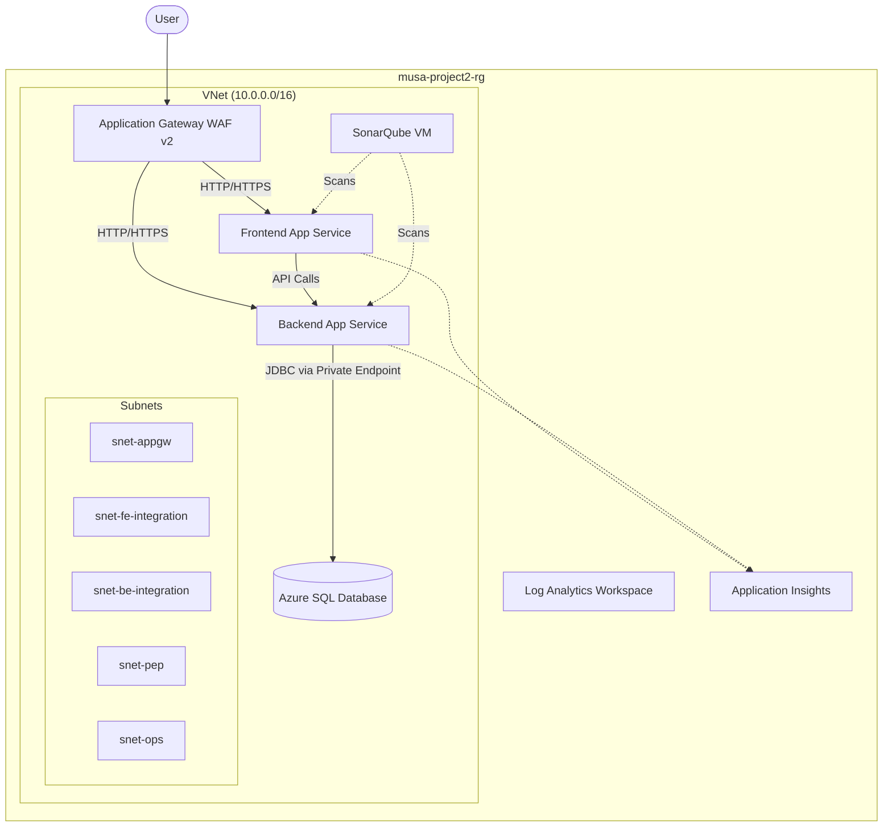

# Architecture Diagram

```mermaid
flowchart TD
    User([User]) --> AppGW[Application Gateway WAF v2]
    
    subgraph "musa-project2-rg"
        subgraph "VNet (10.0.0.0/16)"
            AppGW -->|HTTP/HTTPS| FE[Frontend App Service]
            AppGW -->|HTTP/HTTPS| BE[Backend App Service]
            
            FE -->|API Calls| BE
            BE -->|JDBC via Private Endpoint| SQL[(Azure SQL Database)]
            
            subgraph "Subnets"
                snet_appgw[snet-appgw]
                snet_fe[snet-fe-integration]
                snet_be[snet-be-integration]
                snet_pep[snet-pep]
                snet_ops[snet-ops]
            end
            
            Sonar[SonarQube VM] -.->|Scans| FE
            Sonar[SonarQube VM] -.->|Scans| BE
        end
        
        Log[Log Analytics Workspace]
        AppIns[Application Insights]
        
        FE -.-> AppIns
        BE -.-> AppIns
    end
```
